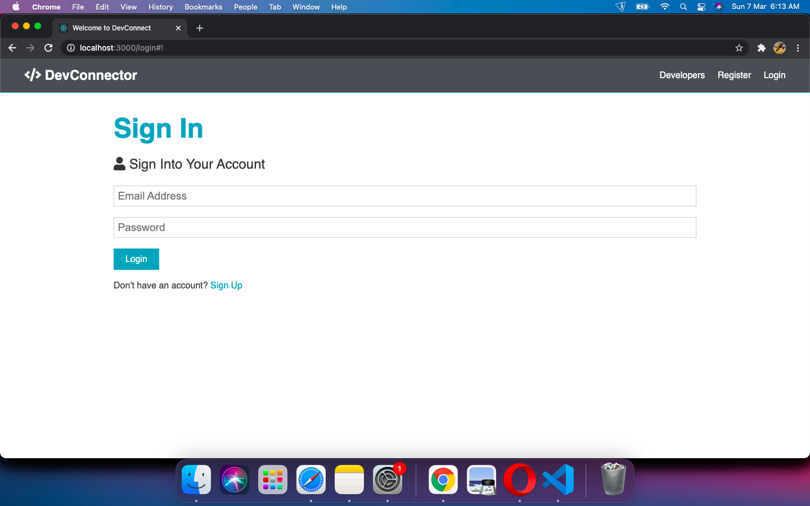
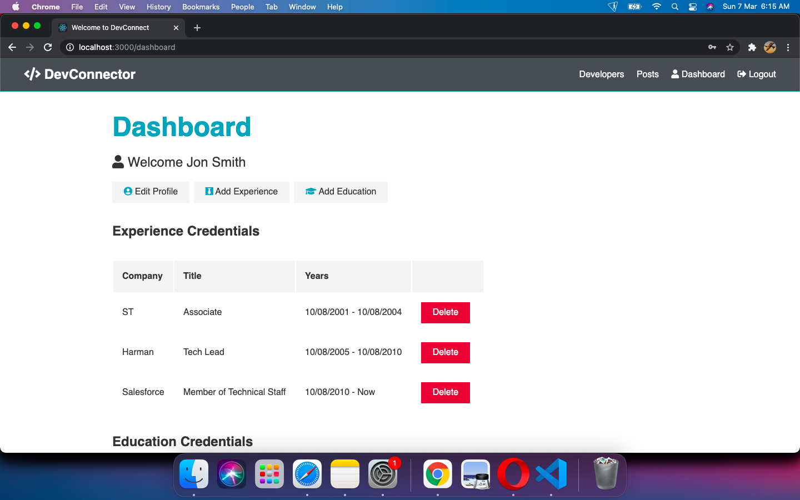
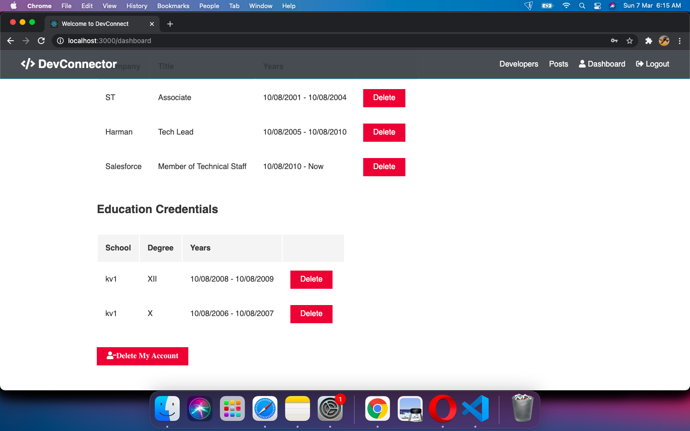
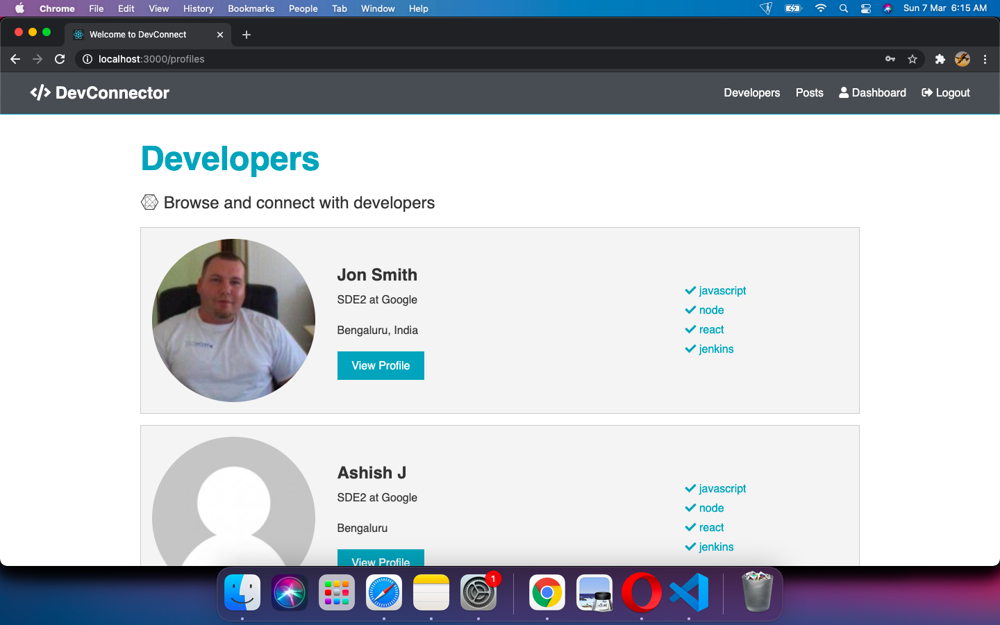
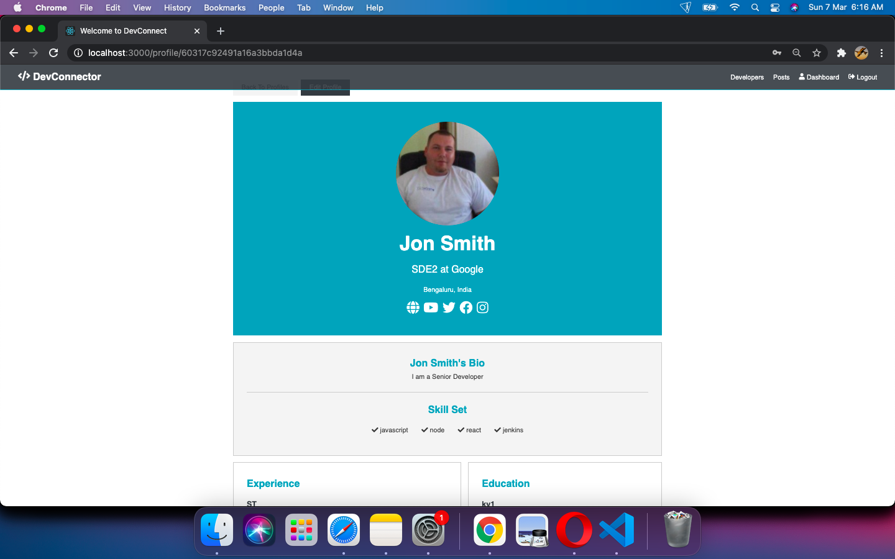
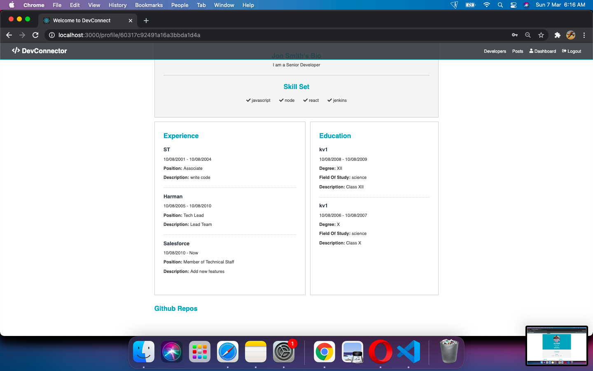
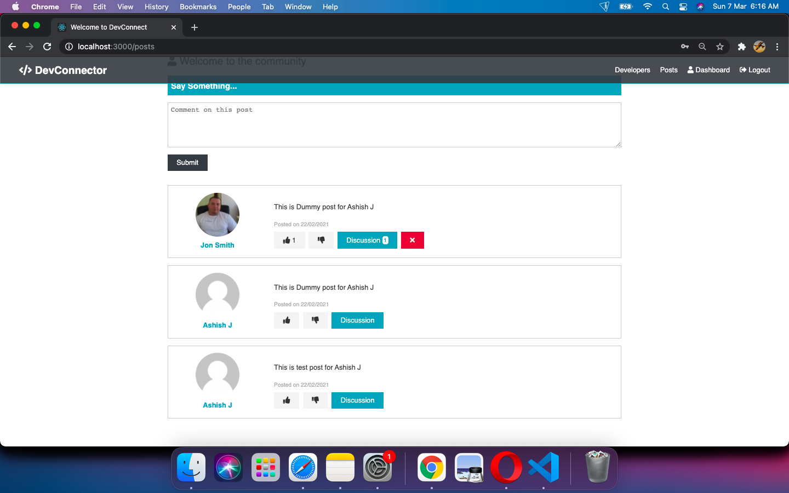
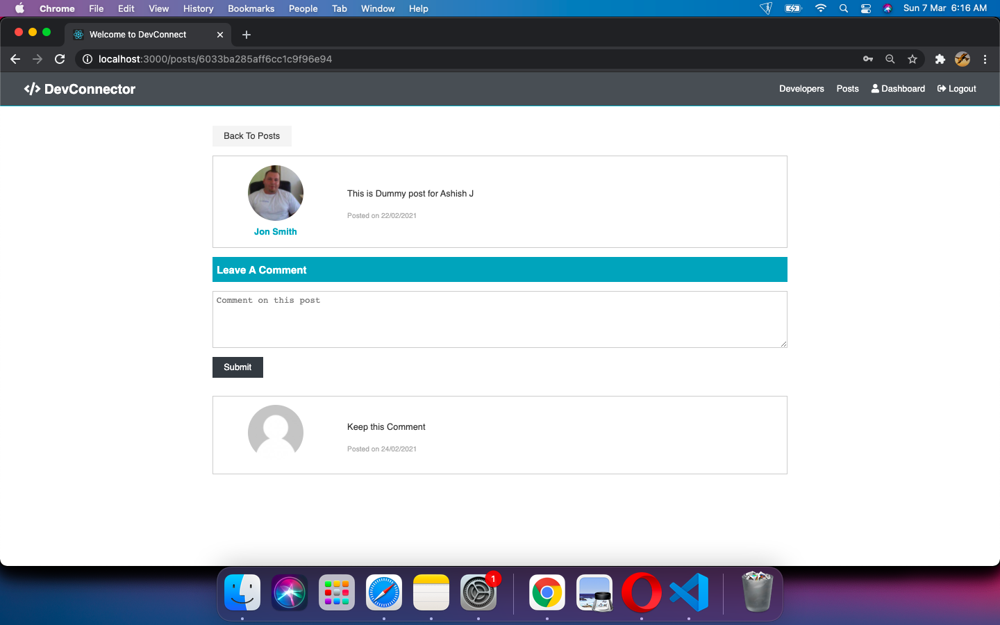

# DevConnector-MERN Stack Project

### Features

- This application was developed based on Udemy course: [MERN Stack Front To Back: Full Stack React, Redux & Node.js](https://www.udemy.com/course/mern-stack-front-to-back/ "Mern-Stack-Front-To-Back")
- As can be inferred from above, backend component utlizes ExpressJS/NodeJs for API(s) and MongoDB as a data store.
- Front end utilizes ReactJsto develop UI, Redux as state management,  as well axios to do REST API calls.
- The deployment as done via Heroku CLI
- For more technical description - refer intructors's repo at [Dev-Connector](https://github.com/bradtraversy/devconnector_2.0) . NOTE: At several places, my code will not match the instructor's repo.
- The github API(s) feature of the solution will not work unless you regenerate User Account Token from GitHub and update the same in default.json. The current token is automatically voided as soon as you check-in into Git repo. OAuth might do the trick.
- Course completion certificate: [Ashish's MERN Stack Certificate - Udemy](https://www.udemy.com/certificate/UC-f07cff1a-9cb0-4aba-9ccb-86b53730ca0f)
- Some snapshots from the application:

